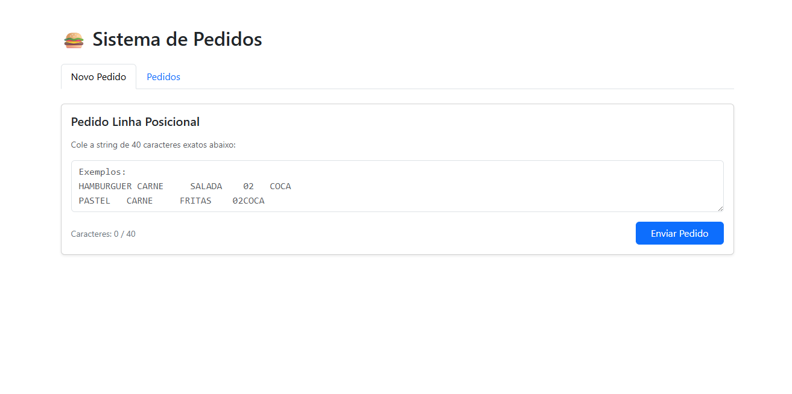
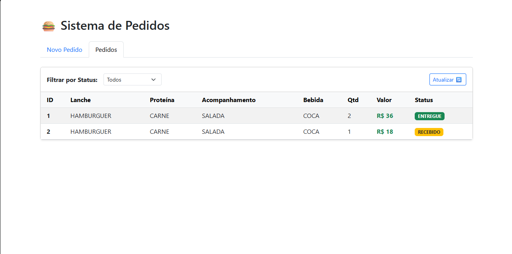
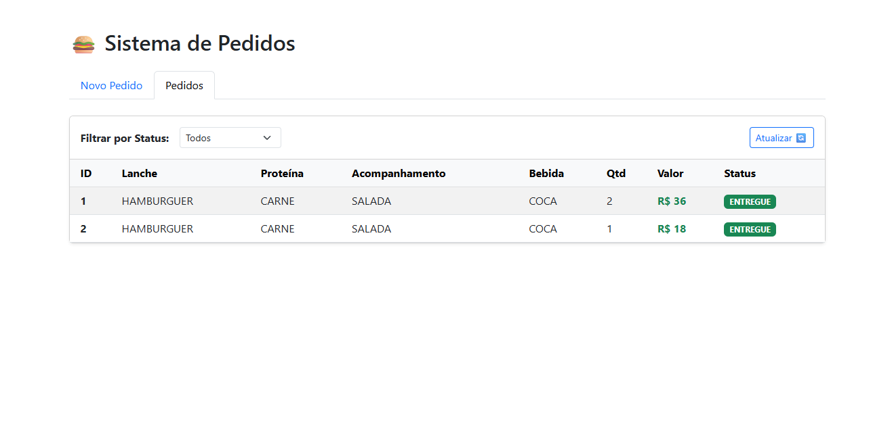

# 🍔 Sistema de Gestão de Pedidos 

Projeto desenvolvido para o processo seletivo de Estágio. 
* O objetivo principal é implementar um mini-sistema de Pedidos de Lanche que processa entradas de dados baseadas em uma string posicional fixa de 40 caracteres.

---

## 🚀 Tecnologias
* **Java 21** 
* **Spring Boot 4.0.5**
* **RabbitMQ** 
* **Angular 21**
* **JPA + Hibernate**
* **H2 Database** 
* **JUnit 5 & AssertJ** (Back-end Tests)
* **Lombok**

---

## Editor / IDE

* **IntelliJ IDEA** 

---

## 🏗️ Arquitetura do Sistema
O sistema utiliza uma comunicação desacoplada para garantir que o processamento de entrega não trave a interface do usuário:

* ✅ **Frontend**: Trata-se de uma interface simples que interage com os módulos backend. Possui uma tela para o usuário enviar a string posicional (simulando a criação do pedido) e uma tabela para listar os pedidos realizados, acompanhada de opções de filtro e recarregamento


* ✅ **Módulo A (Entrada/Gateway)**: É a porta de entrada da aplicação. Ele recebe a string do pedido, realiza validações rigorosas de tamanho e formato, converte a string em um objeto, calcula o valor financeiro do pedido com base em regras de preços e descontos, salva no banco de dados com o status RECEBIDO e publica uma mensagem em uma fila para dar continuidade ao fluxo


* ✅ **Módulo B (Processor)**: Trabalha de forma assíncrona possuindo um Listener que consome as mensagens da fila enviadas pelo Módulo A. Ao receber uma mensagem, ele atualiza o status do respectivo pedido no banco de dados para ENTREGUE. Este módulo também disponibiliza os endpoints de consulta (GET /pedidos) para listar os pedidos

---

## 📸 Screenshots

### Tela Principal (Lista de Pedidos)
<p align="center">
  
</p>

### Status do Processamento (Módulo A) -> Recebido
<p align="center">
  
</p>

### Status do Processamento (Módulo B) -> Entregue
<p align="center">
  
</p>

## ⚙️ Como Executar Localmente


É necessário ter o Java 25 e o Maven instalados e configurados.

### Executando o Back-end

* Abra o projeto raiz na sua IDE (IntelliJ IDEA recomendada).

* Importe os projetos como Maven Projects.

* Execute a classe principal do `Módulo A` (PedidoGatewayApplication).

* Execute a classe principal do `Módulo B` (PedidoProcessorApplication).

### Executando o Front-end (Angular)
   
* É necessário ter o Node.js instalado localmente.


1. Navegue até a pasta do projeto Angular:

```
cd frontend-pedido
```
2. Instale as dependências:

```
npm install
```

3. Inicie a aplicação

```
npm run start
```

1. Front-end
* **Acesse http://localhost:4200 no seu navegador.**

2. API de cadastro (POST)
* **(Gateway)**: `http://localhost:8080/pedidos/posicional`

3. API de consulta (GET)
* **(Processor)**: `http://localhost:8081/pedidos`

## ⚙️ Como Executar Usando Docker

1. Pré-requisitos Docker e Docker Compose instalados.

**Postas são as mesmas das de cima**

### Execução via Docker Compose

1. Na raiz do projeto (onde está o arquivo docker-compose.yml), execute o comando:

```
docker-compose up -d --build
```

2. Acompanhe o processamento em tempo real pelos logs:**

```
docker logs -f modulo-b-processor
```

3. Caso queiram limpar o banco de dados basta apagar a pasta data na raiz do projeto e subir a aplicação novamente.

