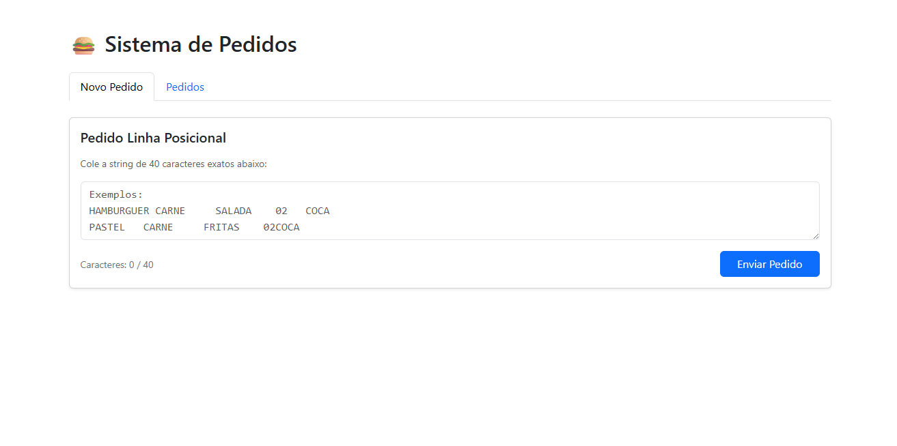
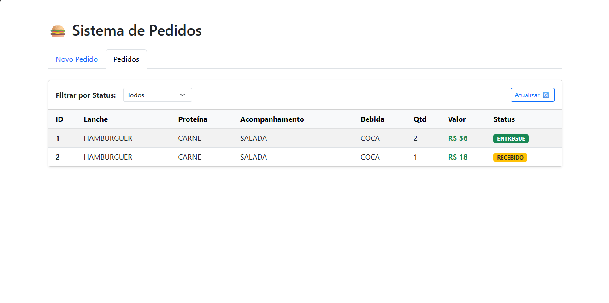
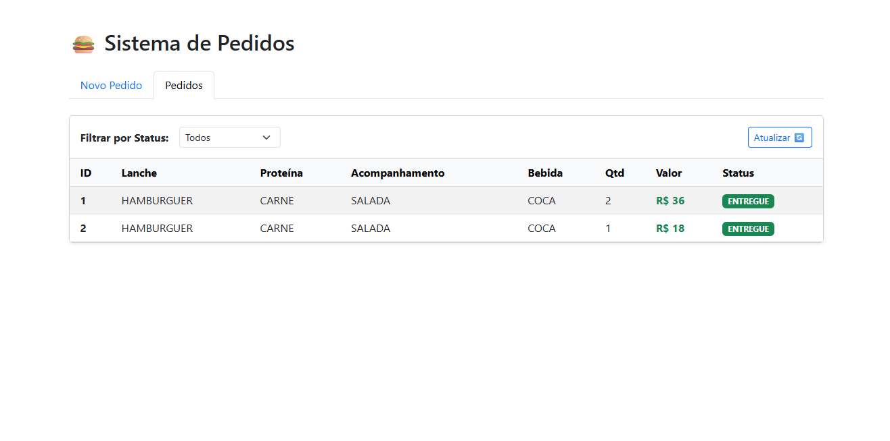

# 🍔 Sistema de Gestão de Pedidos

Projeto desenvolvido para um processo seletivo de estágio.

O sistema recebe pedidos de lanche em uma **string posicional de 40 caracteres**, calcula o valor conforme as regras de negócio e processa a entrega de forma assíncrona com RabbitMQ.

## 🚀 Tecnologias

- Java 21
- Spring Boot 4.0.5
- RabbitMQ
- Angular 21
- Spring Data JPA + Hibernate
- H2 Database
- JUnit 5 + AssertJ
- Lombok
- Docker e Docker Compose

IDE utilizada: **IntelliJ IDEA**.

## 🏗️ Arquitetura

O projeto possui dois módulos backend e uma interface Angular:

| Componente | Responsabilidade | Porta |
|---|---|---|
| `pedido-frontend` | Enviar pedidos e consultar a listagem | `4200` |
| `pedido-gateway` | Interpretar a entrada, calcular o valor, salvar e publicar na fila | `8080` |
| `pedido-processor` | Consumir mensagens, atualizar o status e disponibilizar consultas | `8081` |

### Fluxo do pedido

1. O frontend envia uma linha posicional ao Gateway.
2. O Gateway verifica o comprimento, extrai os campos e calcula o valor.
3. O pedido é salvo com status `RECEBIDO`.
4. O Gateway publica uma mensagem na fila `pedidos.recebidos`:

   ```json
   {
     "pedidoId": 1
   }
   ```

5. O Processor consome a mensagem e atualiza o pedido correspondente para `ENTREGUE`.
6. O frontend consulta a API do Processor para exibir os pedidos.

O processamento pela fila é assíncrono. Por isso, o pedido pode já aparecer como `ENTREGUE` na primeira consulta.

## ⚙️ Execução com Docker

### Pré-requisitos

- Docker instalado e em execução.
- Docker Compose disponível.

### Iniciar a aplicação

Clone o repositório:

```bash
git clone https://github.com/GabrielHolanda18/desafio-anbima.git
cd desafio-anbima
```

Na raiz, onde está o arquivo `docker-compose.yml`, execute:

```bash
docker compose up -d --build
```

O Compose inicia RabbitMQ, Gateway, Processor e frontend.

Acompanhe os logs:

```bash
docker compose logs -f
```

Para acompanhar somente o Processor:

```bash
docker compose logs -f modulo-b
```

### Endereços

| Serviço | Endereço |
|---|---|
| Frontend | http://localhost:4200 |
| Cadastro de pedidos | `POST http://localhost:8080/pedidos/posicional` |
| Consulta de pedidos | `GET http://localhost:8081/pedidos` |
| Painel do RabbitMQ | http://localhost:15672 |

Aguarde a inicialização dos serviços antes de enviar pedidos.

### Encerrar

```bash
docker compose down
```

### Limpar os dados locais

Para reiniciar o banco do ambiente Docker:

1. Encerre os serviços com `docker compose down`.
2. Exclua a pasta `data` da raiz do projeto.
3. Inicie novamente com `docker compose up -d --build`.

**A exclusão da pasta `data` remove os pedidos armazenados nesse ambiente.**

## 💻 Execução local

### Pré-requisitos

- Java 21.
- Maven.
- Node.js em versão compatível com Angular 21 e npm.
- RabbitMQ disponível na porta `5672`.

Os comandos abaixo partem da pasta do repositório clonado.

### 1. Iniciar o RabbitMQ

Você pode usar somente o serviço de mensageria do Compose:

```bash
docker compose up -d rabbitmq
```

Aguarde o RabbitMQ terminar de iniciar antes de executar os backends.

Se o ambiente completo já estiver rodando em Docker, encerre-o antes de iniciar os backends e o frontend localmente, evitando conflitos de portas.

### 2. Iniciar o Gateway

Em um terminal:

```bash
cd pedido-gateway
mvn spring-boot:run
```

### 3. Iniciar o Processor

Em outro terminal, a partir da raiz:

```bash
cd pedido-processor
mvn spring-boot:run
```

Também é possível importar os dois módulos como projetos Maven no IntelliJ IDEA e executar:

- `PedidoGatewayApplication`
- `PedidoProcessorApplication`

### 4. Iniciar o frontend

Em outro terminal, a partir da raiz:

```bash
cd pedido-frontend
npm install
npm run start
```

Acesse http://localhost:4200.

## 📝 Formato da entrada

O endpoint de cadastro recebe o corpo como **texto puro**, com:

```text
Content-Type: text/plain
```

A entrada deve possuir **exatamente 40 caracteres**, respeitando o seguinte layout:

| Campo | Posições | Tamanho | Preenchimento |
|---|---|---|---|
| Tipo de lanche | 1 a 10 | 10 | Espaços à direita |
| Proteína | 11 a 20 | 10 | Espaços à direita |
| Acompanhamento | 21 a 30 | 10 | Espaços à direita |
| Quantidade | 31 a 32 | 2 | Zeros à esquerda |
| Bebida | 33 a 40 | 8 | Espaços à direita |

A quantidade prevista no contrato do desafio vai de `01` a `99`.

**Cuidados ao enviar:**

- Não coloque separadores entre os campos.
- Preserve os espaços finais da bebida.
- Não acrescente uma quebra de linha.
- Envie texto puro, sem envolver a linha em um objeto JSON.

### Decisão sobre preenchimento

O enunciado apresenta orientações diferentes para entradas menores que 40 caracteres: uma menciona completar o preenchimento e outra determina rejeitar.

Nesta implementação, o preenchimento deve ser realizado antes do envio. A API exige exatamente 40 caracteres e rejeita comprimentos diferentes.

## 💰 Regras de preço

| Tipo de lanche | Preço unitário |
|---|---|
| `HAMBURGUER` | R$ 20,00 |
| `PASTEL` | R$ 15,00 |
| Outros | R$ 12,00 |

O valor total corresponde ao preço unitário multiplicado pela quantidade.

A combinação **HAMBURGUER + CARNE + SALADA** recebe **10% de desconto sobre o total**.

A bebida não altera o preço nas regras deste desafio.

## 🧪 Exemplos de requisição

Nos exemplos visuais abaixo, `·` representa um espaço. **Não envie o caractere `·` na requisição real.**

Os comandos com `printf` são destinados a Bash, Git Bash ou WSL e geram a entrada com os espaços necessários, sem quebra de linha.

### Exemplo 1 — Com desconto

| Campo | Valor |
|---|---|
| Tipo de lanche | HAMBURGUER |
| Proteína | CARNE |
| Acompanhamento | SALADA |
| Quantidade | 01 |
| Bebida | COCA |

Representação visual:

```text
HAMBURGUERCARNE·····SALADA····01COCA····
```

Envio:

```bash
printf '%-10s%-10s%-10s%02d%-8s' \
  'HAMBURGUER' 'CARNE' 'SALADA' 1 'COCA' |
curl -i http://localhost:8080/pedidos/posicional \
  -H 'Content-Type: text/plain' \
  --data-binary @-
```

**Resultado esperado:** HTTP `201 Created`, com JSON do pedido e valor de **R$ 18,00**.

### Exemplo 2 — Sem desconto

| Campo | Valor |
|---|---|
| Tipo de lanche | PASTEL |
| Proteína | FRANGO |
| Acompanhamento | BACON |
| Quantidade | 02 |
| Bebida | SUCO |

Representação visual:

```text
PASTEL····FRANGO····BACON·····02SUCO····
```

Envio:

```bash
printf '%-10s%-10s%-10s%02d%-8s' \
  'PASTEL' 'FRANGO' 'BACON' 2 'SUCO' |
curl -i http://localhost:8080/pedidos/posicional \
  -H 'Content-Type: text/plain' \
  --data-binary @-
```

**Resultado esperado:** HTTP `201 Created`, com JSON do pedido e valor de **R$ 30,00**.

### Consultar os pedidos

```bash
curl http://localhost:8081/pedidos
```

## ✅ Testes automatizados

Para executar os testes do Gateway:

```bash
cd pedido-gateway
mvn test
```

Para executar os testes do Processor, em outro terminal a partir da raiz:

```bash
cd pedido-processor
mvn test
```

No Gateway, há testes específicos em `PedidoInputTest` e `PedidoServiceTest`. Entre os cenários de cálculo estão:

- Pedido de pastel sem desconto.
- Pedido de hambúrguer com carne e salada, aplicando 10% de desconto.

Os módulos também possuem testes de carregamento do contexto Spring. Esses testes podem depender das configurações e dos serviços utilizados pela aplicação.

## 🔧 Melhorias previstas

- Validar explicitamente que a quantidade contém dois dígitos e está entre `01` e `99`.
- Ajustar o teste de quantidade zero para esperar rejeição da entrada.
- Melhorar o tratamento de entrada nula.
- Padronizar respostas HTTP para entradas inválidas.
- Ampliar os testes para comprimentos inválidos e campos numéricos incorretos.
- Acrescentar testes de integração do fluxo entre persistência e mensageria.

## 📸 Screenshots

### Tela principal — Lista de pedidos

<p align="center">
  
</p>

### Pedido recebido — Gateway

<p align="center">
  
</p>

### Pedido entregue — Processor

<p align="center">
  
</p>
